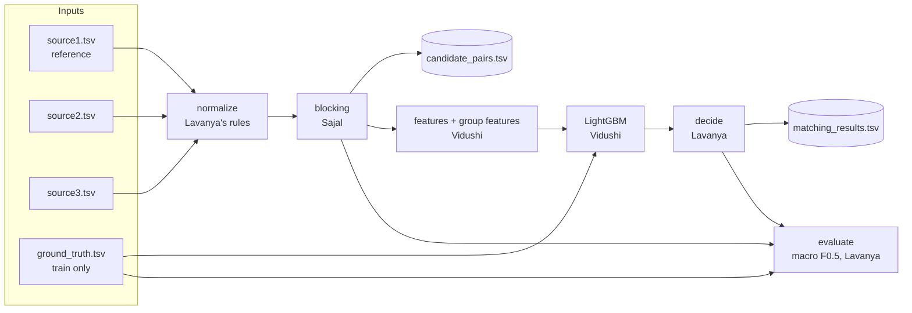
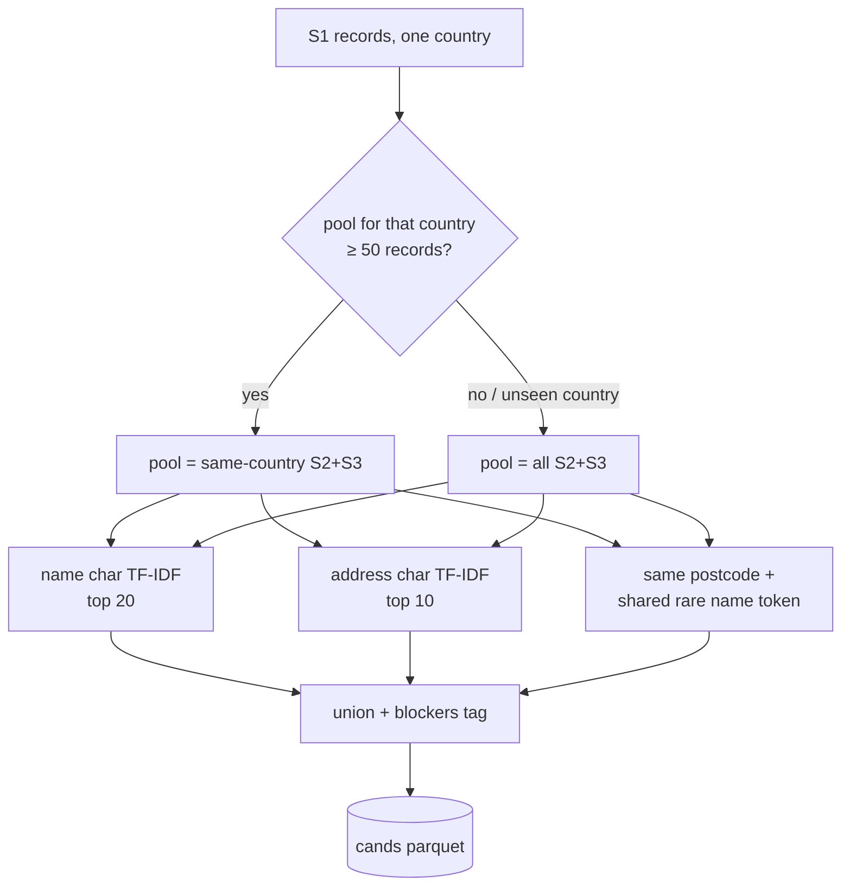

# 05 — System Architecture

## 1. Pipeline overview



## 2. Who owns which box

| Stage | Owner | Module | Output |
|---|---|---|---|
| Load / save | Sajal | `src/io.py` | DataFrames, TSVs, parquet |
| Split | Lavanya | `src/split.py` | `data/splits.json` |
| Normalize | Lavanya (rules), Sajal (runs it) | `src/normalize.py` | `data/norm_*` |
| Block | Sajal | `src/blocking.py` | `data/cands_*` |
| Features | Vidushi | `src/features.py` | `data/feats_*` |
| Train / predict | Vidushi | `src/train.py` | `models/lgbm.txt`, `data/preds_*` |
| Decide | Lavanya | `src/decide.py` | match lists, `decision_params.json` |
| Evaluate | Lavanya | `src/evaluate.py` | F0.5, blocking recall |
| Orchestrate | Sajal | `src/run.py` | `output/*.tsv` |
| Package | Sajal | `src/package.py` | `<team>_submission.zip` |

## 3. Blocking detail



## 4. Validation vs test runs

```mermaid
flowchart LR
  subgraph Val run
    TR[train S1 ids] --> CF[cands_trainfit] --> FIT[fit model]
    VA[val S1 ids] --> CV[cands_val] --> PV[preds_val] --> TUNE[tune decide params] --> SCORE[val F0.5]
    FIT --> PV
  end
  subgraph Test run
    ALL[all train S1 ids] --> REFIT[refit model]
    TE[test S1 ids] --> CT[cands_test] --> PT[preds_test] --> DEC[decide with saved params] --> OUT[output TSVs]
    REFIT --> PT
  end
  TUNE -. decision_params.json .-> DEC
```

## 5. Decision records

**ADR-1: Multi-blocker union instead of a single retriever.**
Different noise types break different blockers. Typos break exact postcode matching, and landmark addresses break address TF-IDF. A union of cheap blockers gives high recall. The `blockers` column shows which blocker found each true match, which guides tuning.

**ADR-2: Gradient-boosted trees (LightGBM) on hand-built similarity features, not a deep model.**
It is fast to train, explainable through feature importance, MIT licensed, and works well on small tabular similarity features. It can be built in one day.

**ADR-3: Group features.**
Whether a pair matches depends on its competitors. The best candidate by a clear margin is much more likely to be a match than one of five near-ties. Cheap rank and gap features capture this.

**ADR-4: The decision layer is separate from the model and tuned directly on macro F0.5.**
The metric is per-entity and precision-heavy, and it rewards empty lists for singletons. A plain 0.5 probability cutoff is not optimal. Tuning `threshold` and `min_top` on the true metric fixes that.

**ADR-5: Country-agnostic everything.**
The test set has France, which is unseen. Normalization has no country branches, the model has no raw country feature, and blocking falls back to the whole pool for unseen or small countries. This is checked by training on US and validating on India (V6).

**ADR-6: The one-to-one assignment is conditional.**
It gives a large precision gain only if the data supports it. Lavanya's EDA (L1) decides, and the flag is stored in `decision_params.json`.

**ADR-7: File ownership plus contracts, merged through PRs only.**
Three people and three AI agents are working in parallel. Separate files mean no merge conflicts, and fixed contracts mean nobody waits on anybody.
